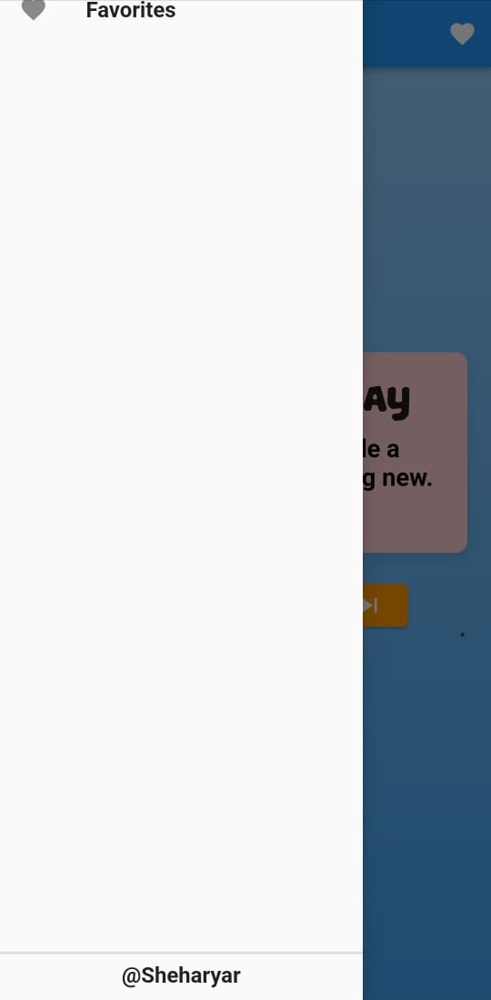
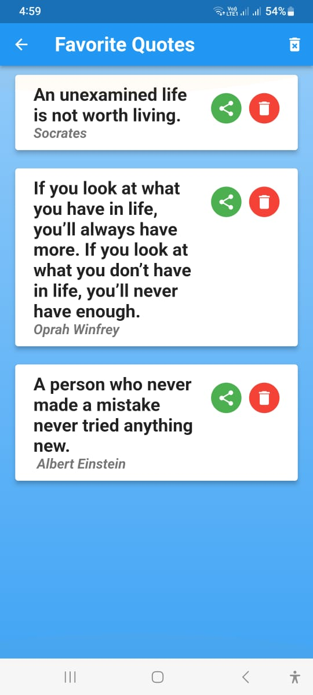
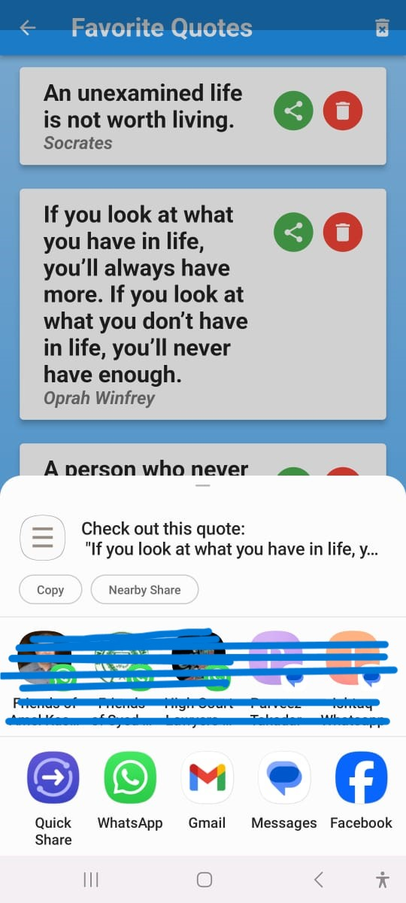

# Quote of the Day App

## Overview

The Quote of the Day App is a Flutter-based mobile application that delivers a daily inspirational quote to users. This README provides comprehensive documentation on the app's features, architecture, and how to use and customize it.

**Screenshots**:

<div style="display: flex; justify-content: center;">
  
  
  
  
  
</div>

**Download**:

- [Android App](https://cssduet.acm.org/apps_shery/QuoteApp.apk)
- [Windows App](https://cssduet.acm.org/apps_shery/QuoteApp.rar)

## Table of Contents

1. [Introduction](#introduction)
2. [Getting Started](#getting-started)
   - [Prerequisites](#prerequisites)
   - [Plugins Used](#plugins-used)
   - [Installation](#installation)
3. [Features](#features)
   - [Daily Quote](#daily-quote)
   - [Favorite Quotes](#favorite-quotes)
   - [Share Quotes](#share-quotes)
   - [Customization](#customization)
4. [Architecture](#architecture)
5. [Contributing](#contributing)
6. [License](#license)

## Introduction

The Quote of the Day App is designed to provide users with a daily dose of inspiration. It offers a daily quote, the ability to mark favorite quotes, and the option to share quotes with others.

## Getting Started

### Prerequisites

Before you can run the Quote of the Day App, make sure you have the following prerequisites installed:

- Flutter: Ensure you have the Flutter SDK installed on your system. You can download it from [here](https://flutter.dev/docs/get-started/install).

### Plugins Used

The Quote of the Day App utilizes the following Flutter plugins:

- [shared_preferences](https://pub.dev/packages/shared_preferences): Version 2.0.8. This plugin is used for storing and retrieving user preferences, such as favorite quotes.
- [share](https://pub.dev/packages/share): Version 2.0.4. The Share plugin is used for sharing quotes with other users.
- (Add any other plugins you may be using)

### Installation

1. Clone the repository from GitHub:

   ```bash
git clone https://github.com/Shery-1508/Codsoft.git
   ```


## Features

### Daily Quote

- The app provides users with a daily inspirational quote on the home screen.
- The daily quote is fetched from a predefined list of quotes.
- Users can double-tap the quote to add it to their list of favorite quotes.

### Favorite Quotes

- Users can mark their favorite quotes by double-tapping on them.
- Favorite quotes are stored locally using shared_preferences.
- A heart icon is displayed on favorite quotes for easy identification.

### Share Quotes

- Users can share quotes with others by tapping the share icon.
- The Share plugin is used to enable sharing via various platforms.

### Customization

- The app's theme can be customized in the code.
- Fonts, colors, and styles can be adjusted to match your preferences.
- Additional customizations can be made to suit your needs.

## Architecture

The Quote of the Day App follows a structured architecture:

- `main.dart`: Entry point of the app, including theme setup and routing.
- `favorites_screen.dart`: Screen for displaying favorite quotes and managing them.
- `quotes.json`: JSON file containing a collection of quotes.
- (Add more details about your app's architecture)

## Contributing

Contributions to the Quote of the Day App are welcome! If you find a bug, have an idea for an improvement, or want to add new features, please open an issue or submit a pull request on the GitHub repository.

## License

This project is open-source and available under the [MIT License](LICENSE). You are free to use and modify the code according to your needs.

## Download

### Android App

You can download the Android version of the Quote of the Day App from [here](https://cssduet.acm.org/apps_shery/QuoteApp.apk)

### Windows App

You can download the Windows version of the Quote of the Day App from [here](https://cssduet.acm.org/apps_shery/QuoteApp.rar)

---

Thank you for using the Quote of the Day App! If you have any questions or need further assistance, please don't hesitate to contact us.

Stay inspired!
